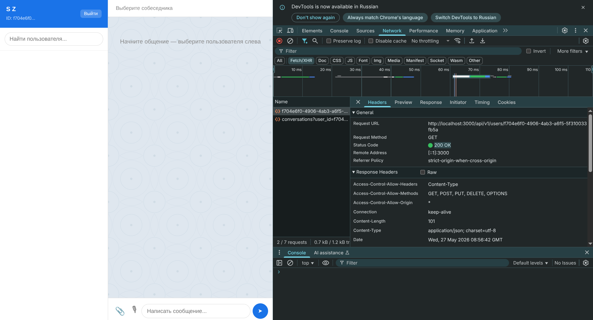

# Messager quickstart

## 1. Локально 

```kubectl apply -k k8s/overlays/dev```

## 2. Argo CD

### Dev

```kubectl apply -f argocd/argocd-app-dev.yaml```

### Prod

```kubectl apply -f argocd/argocd-app-prod.yaml```

## 3. Проброс порта(пример для dev)

```kubectl port-forward -n messager-dev svc/frontend-dev 3000:80```

Приложение будет доступно по адресу http://localhost:8080
