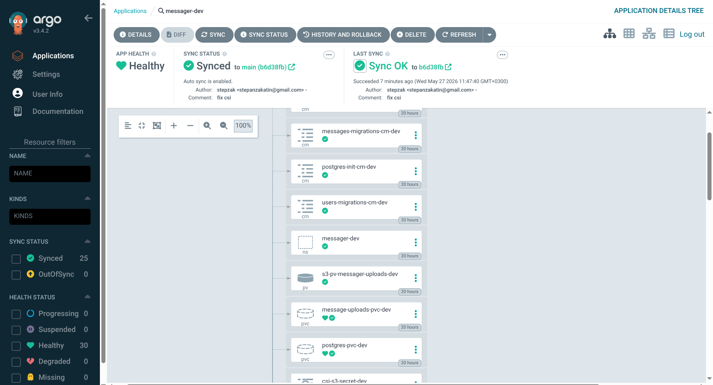

# Отчёт по лабораторной работе: Запуск микросервисного приложения в Kubernetes

## 1. Состав приложения

Приложение состоит из следующих компонентов:

- `frontend` (nginx + SPA), внешний вход в систему
- `bff` (Backend For Frontend), агрегирует API
- `user-service`, работа с пользователями
- `message-service`, работа с сообщениями и файлами
- `postgres`, единый инстанс БД с двумя БД внутри (`messager_users`, `messager_messages`)
- `migrate-users`, `migrate-messages` (job для применения миграций)

## 2. Dev vs Prod + Node Affinity
См. [dev-vs-prod.md](dev-vs-prod.md)

## 3. Argo CD

1. [dev](../argocd/argocd-app-dev.yaml)
2. [prod](../argocd/argocd-app-prod.yaml) (включен Prune + SelfHeal)

